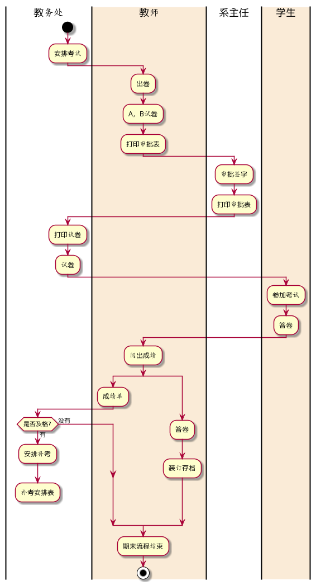
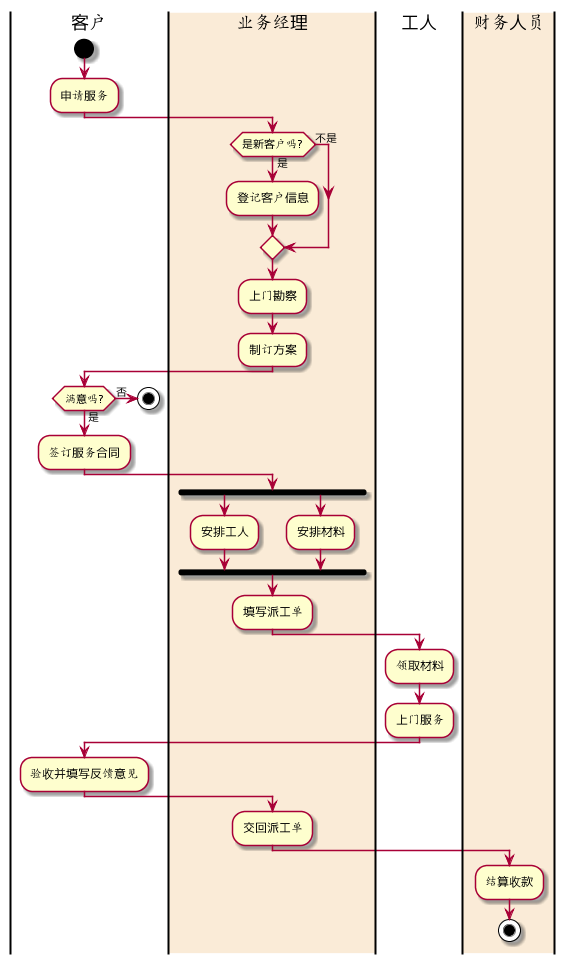

# TEST1 业务流程图建模 #
#### 学号：201710414102 
#### 班级：软工（本）17-1
#### 姓名：陈珏岷

** **

## 一、考试及成绩管理流程：
<h3> 1.plantUML代码如下： 
<h3>

``` 
@startuml
|教务处|
start
:安排考试;
|#AntiqueWhite|教师|
:出卷;
:A，B试卷;
:打印审批表;
|系主任|
:审批签字;
:打印审批表;
|教务处|
:打印试卷;
:试卷;
|#AntiqueWhite|学生|
:参加考试;
:答卷;
|#AntiqueWhite|教师|
:阅出成绩;
 split
:成绩单;
|教务处|
if(是否及格?) then(有)
:安排补考;
:补考安排表;
detach
else(没有)
endif
split again
|#AntiqueWhite|教师|
:答卷;
:装订存档;
end split
:期末流程结束;
stop
@enduml
```
</h3>
<h2> 2.业务流程图如下：</h2>



** **

## 二、客户维护服务流程：
<h3> 1.plantUML代码如下： </h3>
<h3>

``` 
@startuml
|客户|
start
:申请服务;
|#AntiqueWhite|业务经理|
if(是新客户吗?) then(是)
:登记客户信息;
else(不是)
endif
:上门勘察;
:制订方案;
|客户|
if(满意吗?) then(否)
stop
else(是)
:签订服务合同;
|#AntiqueWhite|业务经理|
fork
:安排工人;
fork again
:安排材料;
endfork
:填写派工单;
|工人|
:领取材料;
:上门服务;
|客户|
:验收并填写反馈意见;
|#AntiqueWhite|业务经理|
:交回派工单;
|#AntiqueWhite|财务人员|
:结算收款;
stop
@enduml
```
</h3>
<h3> 2.业务流程图如下：</h3>


