# 实验2：图书管理系统用例建模

|学号|班级|姓名|照片|
|:-------:|:-------------: | :----------:|:---:|
|201710414102|软件(本)17-1|陈珏岷|

## 1. 图书管理系统的用例关系图

### 1.1 用例图PlantUML源码如下：

``` usecase
@startuml
actor 管理员
actor 读者
rectangle 图书管理系统用例图{
left to right direction
                      :管理员: -=> (借出图书)
                      :管理员: -=> (归还图书)
                      :管理员: -=> (管理书目)
                      :管理员: -=> (管理读者借阅信息)
                      (管理书目) ..> (书籍丢失):<<include>>
                      (管理书目) ..> (新书添置):include
                      (管理读者借阅信息) ..> (逾期通知):include
                      (管理读者借阅信息) ..> (逾期处罚):include

                      :读者: -=> (查询书目)
                      :读者: -=> (查询个人借阅情况)
                      :读者: -=> (书籍预定)
                      (续借) ..> (书籍预定):extend
}
@enduml
```


### 1.2. 用例图如下：

参见图7.6

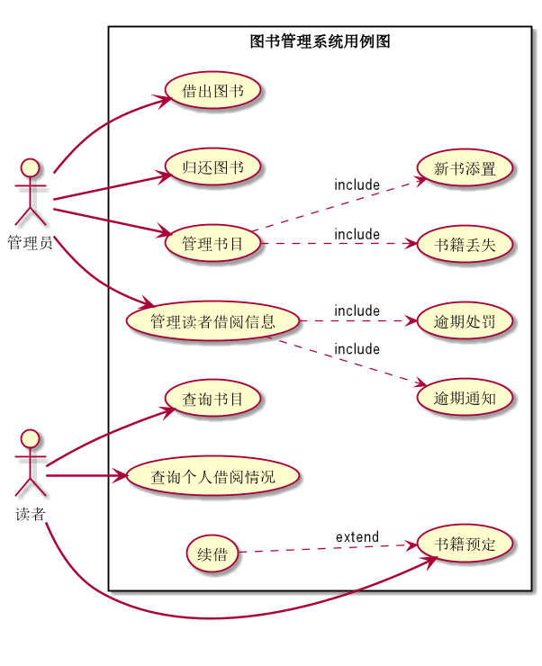

## 2. 参与者说明：

###     2.1 管理员

主要职责是： 
1. 在借出和回收图书后对系统中管理的图书进行更新确认。 
2. 通知逾期没有还书的读者。
3. 进行逾期处罚的相应措。


###     2.2 读者

主要职责是：
1. 查询和借阅书籍.
2. 提前预定想要借阅的书籍。


##     3. 用例规约表

###     3.1 “借出图书”用例

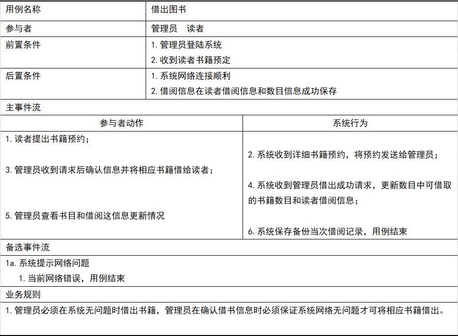


********************************************************

###     3.2 “归还图书”用例

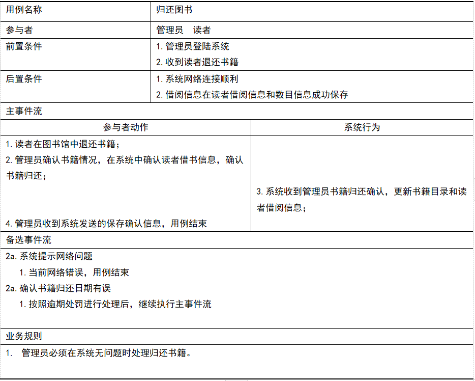


********************************************************


###     3.3 “管理书目”用例

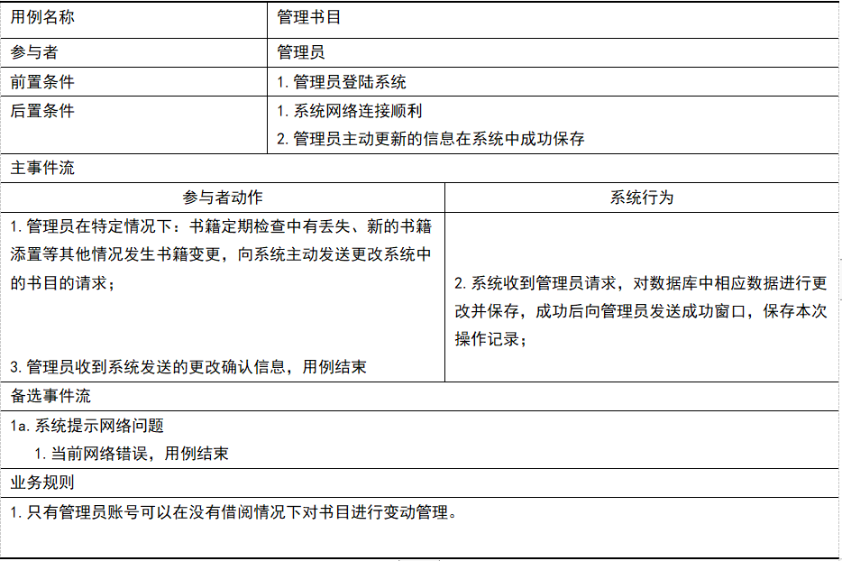


********************************************************


###     3.4 “书籍丢失”用例

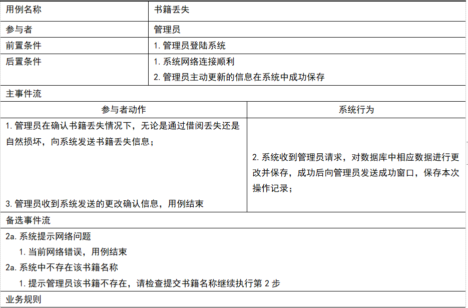


********************************************************


###     3.5 “新书添置”用例

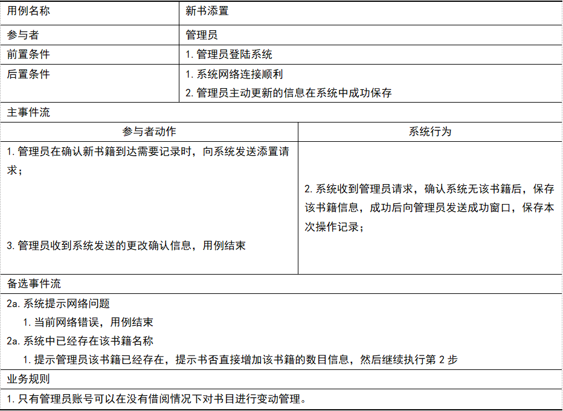


********************************************************


###     3.6 “管理读者借阅信息”用例

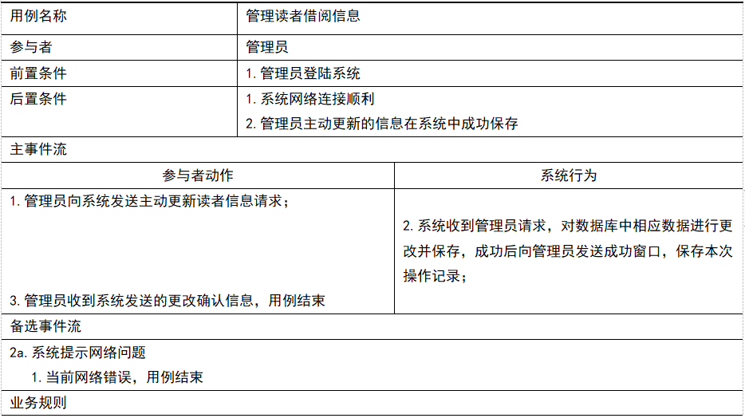


********************************************************


###     3.7 “逾期通知”用例

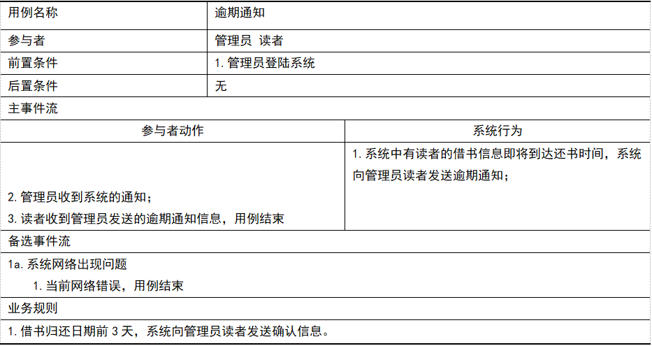


********************************************************


###     3.8 “逾期处罚”用例

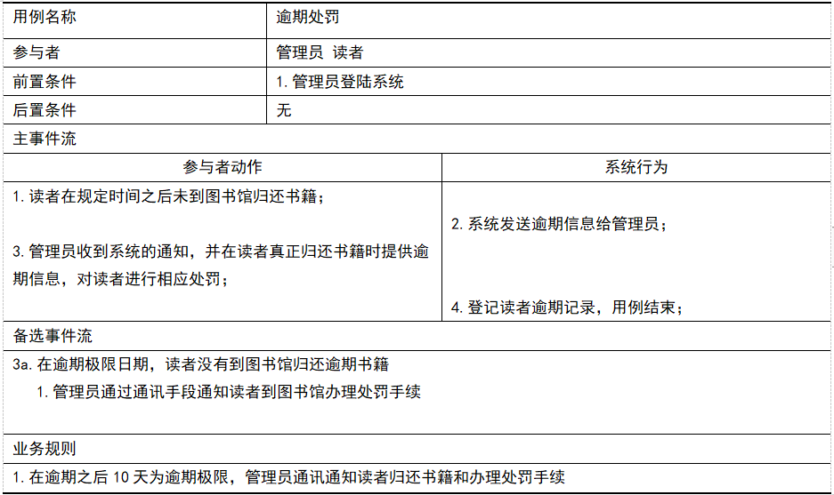


********************************************************


###     3.9 “查询书目”用例

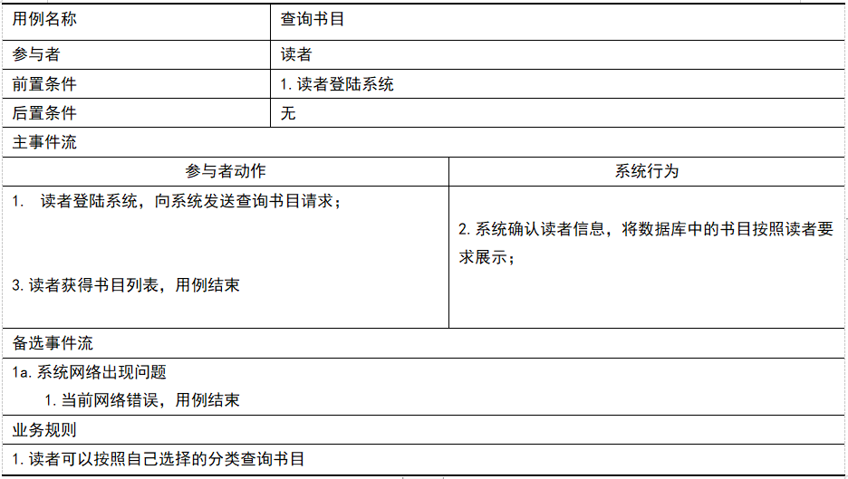


********************************************************


###     3.10 “查询书目”用例

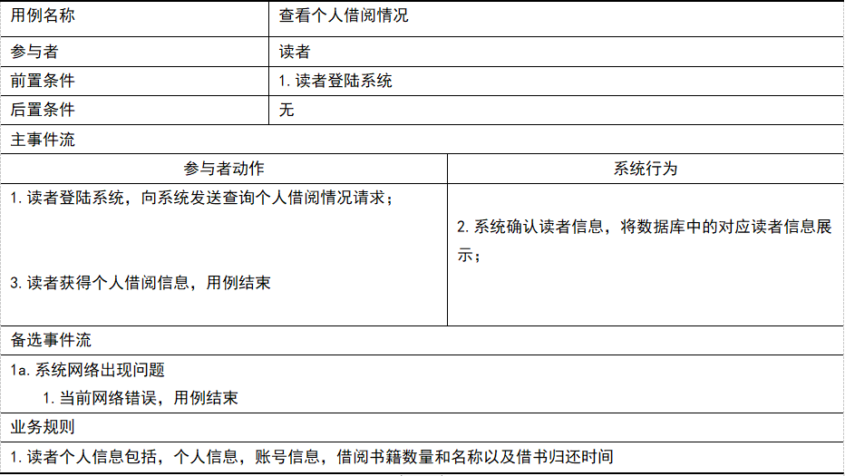


********************************************************

###     3.11 “书籍预定”用例

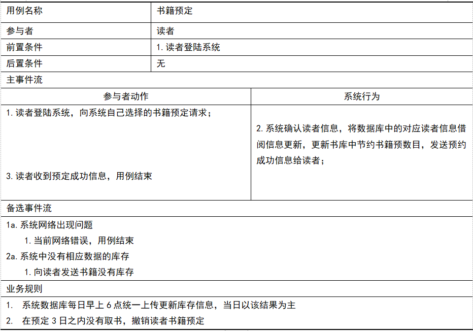


********************************************************


###     3.12 “续借”用例

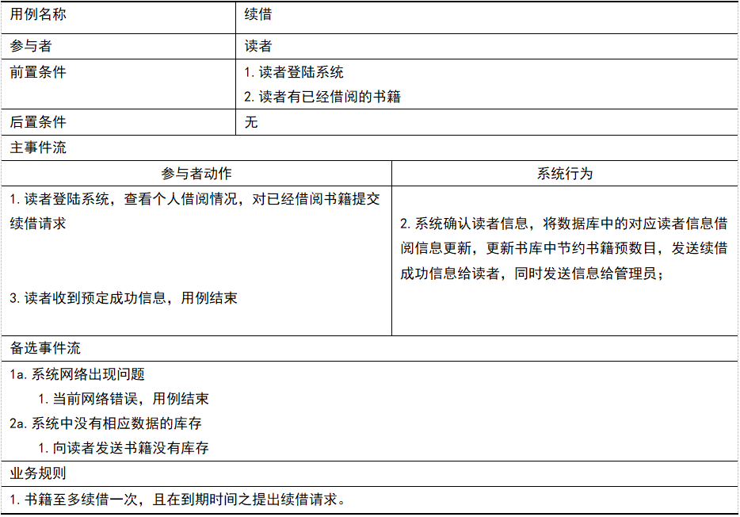


********************************************************
