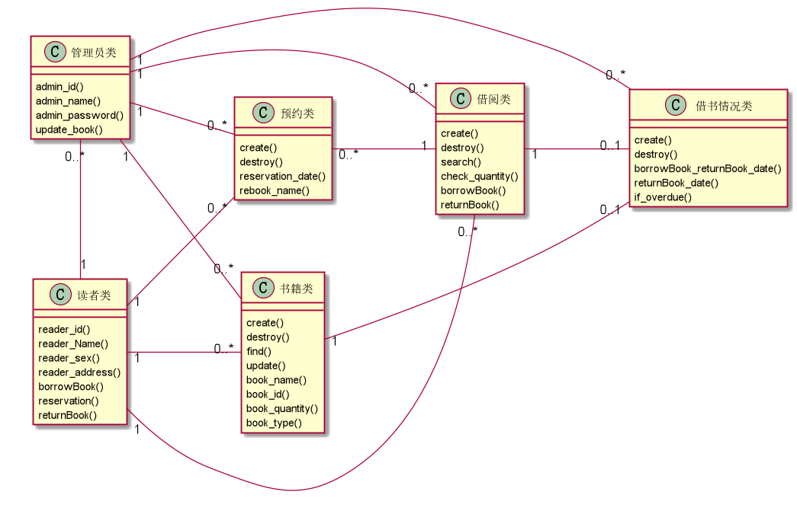

# 实验3：图书管理系统领域对象建模
|学号|班级|姓名|照片|
|:-------:|:-------------: | :----------:|:---:|
|201710414102|软件(本)17-1|陈珏岷||

## 1. 图书管理系统的类图
---

### 1.1 类图PlantUML源码如下：

``` 
@startuml
left to right direction

class 书籍类 {
  create()
  destroy()
  find()
  update()
  book_name()
  book_id()
  book_quantity()
  book_type()
}

class 借阅类 {
  create()
  destroy()
  search()
  check_quantity()
  borrowBook()
  returnBook()
}

class 预约类 {
  create()
  destroy()
  reservation_date()
  rebook_name()
}

class 读者类 {
  reader_id()
  reader_Name()
  reader_sex()
  reader_address()
  borrowBook()
  reservation()
  returnBook()
}

class 管理员类 {
  admin_id()
  admin_name()
  admin_password()
  update_book()
}

class 借书情况类 {
  create()
  destroy()
  borrowBook_returnBook_date()
  returnBook_date()
  if_overdue()
}

读者类"1"--"0..*" 借阅类
读者类"1"--"0..*" 预约类
读者类 "1"--"0..*"书籍类

管理员类"1"-"0..*"读者类
管理员类"1"-"0..*"借阅类
管理员类"1"-"0..*"借书情况类
管理员类"1"-"0..*"预约类
管理员类"1"-"0..*"书籍类

书籍类 "1"--"0..1" 借书情况类
预约类 "0..*"-- "1"借阅类
借阅类 "1"--"0..1" 借书情况类

@enduml
```

### 1.2. 类图如下：



### 1.3. 类图说明：
1. 管理员类有管理员的id号，姓名，密码，还有更新书籍目录（书籍的增删改查）。
2. 读者类中包括的读者的基本属性，id号，姓名，性别，地址，还有读者的借书，预约和还书的操作。
3. 预约类中包含了读者的借书时间和借书人的姓名
4. 书籍类包裹的书的基本属性，包括了书名，书id号，书的库存，书的类型。
5. 借阅类中有读者借书的基本属性，包括了，借阅书库存查询，借书时间，还书时间。
6. 借书情况中，管理员可以查看到读者的借书日期，还书日期，是否逾期

## 2. 图书管理系统的对象图
---
### 2.1 读者类的对象图
#### 源码如下：
``` class
@startuml
object 读者类 {
read_id : Integer
read_Name : Integer
read_sex : Integer
read_address : String
borrowBook : bBook
returnBook : rBook
reservations : reservation
}
@enduml
``` 


### 2.2 管理员类的对象图
#### 源码如下：
``` class
@startuml
object 管理员类 {
admin_id : Integer
admin_name : Integer
admin_password : String
update_book : ubooks
}
@enduml
``` 


### 2.3 书籍类的对象图
#### 源码如下：
``` class
@startuml
object 借阅类 {
check_quantity:checkQ
borrowBook : bBook
returnBook ： rBook
}
@enduml
``` 


### 2.4 借阅类的对象图
#### 源码如下：
``` class
@startuml
object user2 {
name = "Dummy"
id = 123
}
@enduml
``` 
#### 以上的按顺序对象图如下：

