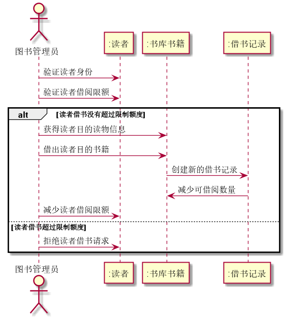
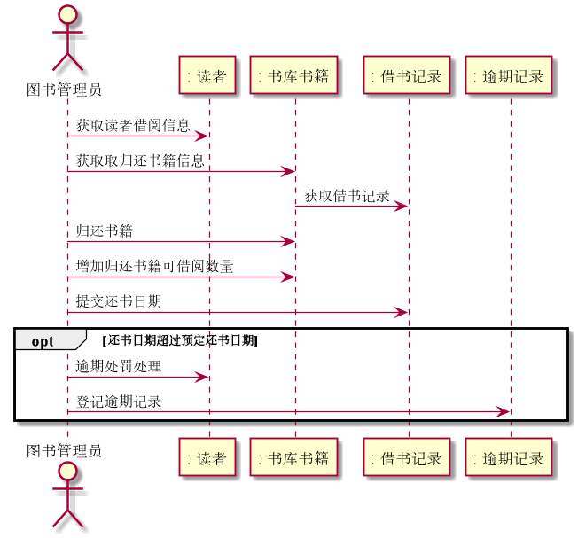
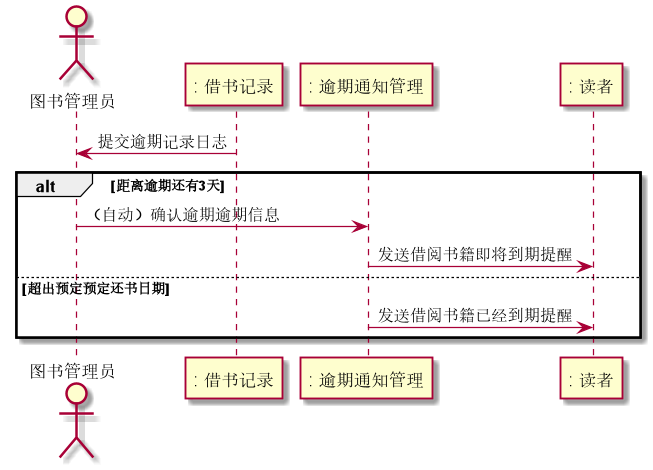
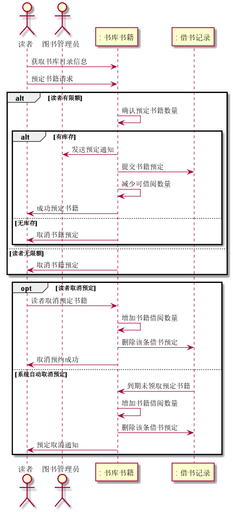
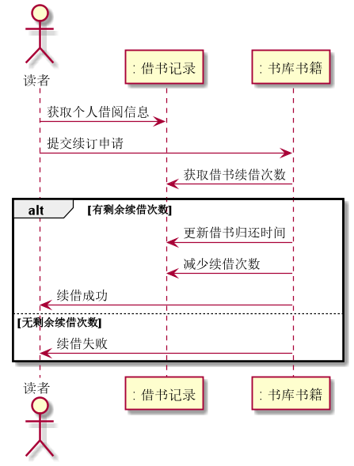

# 实验4：图书管理系统顺序图绘制（老师示范）
|学号|班级|姓名|照片|
|:-------:|:-------------: | :----------:|:---:|
|201710414102|软件(本)17-1|陈珏岷||

## 图书管理系统的顺序图

## 1. 借出图书用例
## 1.1. 借出图书用例PlantUML源码

``` 
@startuml
actor 图书管理员
图书管理员 -> ":读者" :验证读者身份
图书管理员 -> ":读者" :验证读者借阅限额
alt 读者借书没有超过限制额度
图书管理员 -> ":书库书籍" :获得读者目的读物信息
图书管理员 -> ":书库书籍" :借出读者目的书籍
":书库书籍" -> ":借书记录" :创建新的借书记录
":借书记录" -> ":书库书籍" :减少可借阅数量
图书管理员 -> ":读者" :减少读者借阅限额

else 读者借书超过限制额度
图书管理员 -> ":读者" :拒绝读者借书请求
end

@enduml
```

## 1.2. 借出图书用例顺序图


## 1.3. 借出图书顺序图说明
a. 管理首先验证读者的身份，然后查询该读者是否有剩余借阅的额度。  
b. 若查询没有借阅额度，则拒绝借阅；若有额度，则借出书籍，并更新书库中该书籍的可借阅数量，并创建新的借记录。

***

## 2. 归还图书用例
## 2.1. 归还图书用例PlantUML源码

``` 
@startuml
actor 图书管理员
 图书管理员 -> ": 读者" :获取读者借阅信息
图书管理员 -> ": 书库书籍" :获取取归还书籍信息
 ": 书库书籍" -> ": 借书记录" :获取借书记录
图书管理员 -> ": 书库书籍" :归还书籍
图书管理员 -> ": 书库书籍" :增加归还书籍可借阅数量
图书管理员 -> ": 借书记录" :提交还书日期

opt 还书日期超过预定还书日期
图书管理员 -> ": 读者" :逾期处罚处理
图书管理员 -> ": 逾期记录" :登记逾期记录
end

@enduml

```

## 2.2. 归还图书用例顺序图


## 2.3. 归还图书用例顺序图说明
a. 管理员通过系统获取到还书读者和归还书籍的信息，收到归还书籍后，更新书库中的信息，提交归还时间记录。  
b. 系统若提示到读者逾期，则管理员对读者进行相应的处罚并登记逾期的记录

***

## 3. 逾期通知用例
## 3.1. 逾期通知用例PlantUML源码

``` 
@startuml
actor 图书管理员
": 借书记录" ->  图书管理员 :提交逾期记录日志
alt 距离逾期还有3天
图书管理员 -> ": 逾期通知管理" :（自动）确认逾期逾期信息
": 逾期通知管理" -> ": 读者" :发送借阅书籍即将到期提醒
else 超出预定预定还书日期
": 逾期通知管理" -> ": 读者" :发送借阅书籍已经到期提醒
end
@enduml

```

## 3.2. 逾期通知用例顺序图


## 3.3. 逾期通知用例顺序图说明
a. 管理员收到借书记录的日志信息。
b. 在快到达逾期时间之前，通知管理系统会发送信息提醒读者。  
c. 读者已经逾期，通知管理系统会发送逾期提醒读者。

***
## 4. 书籍预定用例
## 4.1. 书籍预定用例PlantUML源码

``` 
@startuml
actor 读者
actor 图书管理员
读者 -> ": 书库书籍" :获取书库目录信息
读者 -> ": 书库书籍" :预定书籍请求
alt 读者有限额

": 书库书籍" -> ": 书库书籍" :确认预定书籍数量
alt 有库存
": 书库书籍" -> 图书管理员:发送预定通知
": 书库书籍" -> ": 借书记录":提交书籍预定
": 书库书籍" -> ": 书库书籍":减少可借阅数量
": 书库书籍" -> 读者:成功预定书籍
else 无库存
": 书库书籍" -> 读者:取消书籍预定
end
else 读者无限额
": 书库书籍" -> 读者:取消书籍预定
end

opt 读者取消预定
读者 -> ": 书库书籍" :读者取消预定书籍
": 书库书籍" -> ": 书库书籍" :增加书籍借阅数量
": 书库书籍" -> ": 借书记录" :删除该条借书预定
": 书库书籍" -> 读者 :取消预约成功
else 系统自动取消预定
": 借书记录" -> ": 书库书籍" :到期未领取预定书籍
": 书库书籍" -> ": 书库书籍" :增加书籍借阅数量
": 书库书籍" -> ": 借书记录" :删除该条借书预定
": 书库书籍" -> 读者 :预定取消通知
end

@enduml

```

## 4.2. 书籍预定用例顺序图


## 4.3. 书籍预定用例顺序图说明
a. 读者浏览书库的目录，查询自己想要的书籍，提交书籍预定请求。  
b. 读者有限额且书库有库存，书库向借书记录提交书籍预定，并减少该书籍可借阅数量;无库存和读者无限额系统都会取消该次预定。

***

## 5. 续订用例
## 5.1. 续订用例PlantUML源码

``` 
@startuml
actor 读者
读者 -> ": 书库书籍" :获取个人借阅信息
读者 -> ": 书库书籍" :提交续订申请
": 书库书籍" -> ": 借书记录" :获取借书续借次数
alt 有剩余续借次数
": 书库书籍" -> ": 借书记录" :更新借书归还时间
": 书库书籍" -> ": 借书记录" :减少续借次数
": 书库书籍" -> 读者 :续借成功
else 无剩余续借次数
": 书库书籍" -> 读者 :续借失败
end

@enduml

```

## 5.2. 续订用例顺序图


## 5.3. 续订用例顺序图说明
a. 读者获取自己的借阅情况。  
b. 读者想书库提交续订请求，若该读者本书还有剩余续借次数，则更新借书的归还时间，减少可续借次数，并提示续借成功；若无续借次数，则续借请求失败

***

